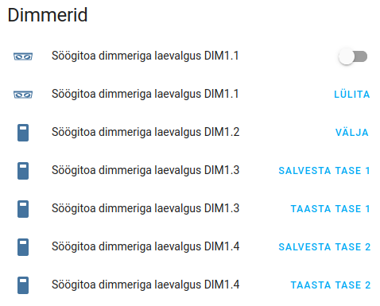
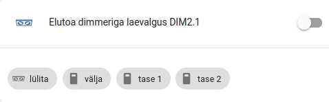

# Controlling IHC dimmers in Home Assistant

Suppose you use the IHC Output 24 module 14 for controlling the IHC 400 UNI
dimmer.

IHC outputs 1..4 are connected to dimmer terminals 1..4.

In the `switches.yaml` you define the following IHC outputs:

```yaml
    dim1_1:
      friendly_name: Livingroom ceiling dimmer DIM1.1
      command_on:  curl --silent 'http://192.168.1.111:8081/ihcrequest' --data-binary '{"type":"setOutput","moduleNumber":14,"ioNumber":1,"state":true}'
      command_off: curl --silent 'http://192.168.1.111:8081/ihcrequest' --data-binary '{"type":"setOutput","moduleNumber":14,"ioNumber":1,"state":false}'

    dim1_2:
      friendly_name: Livingroom ceiling dimmer DIM1.2
      command_on:  curl --silent 'http://192.168.1.111:8081/ihcrequest' --data-binary '{"type":"setOutput","moduleNumber":14,"ioNumber":2,"state":true}'
      command_off: curl --silent 'http://192.168.1.111:8081/ihcrequest' --data-binary '{"type":"setOutput","moduleNumber":14,"ioNumber":2,"state":false}'

    dim1_3:
      friendly_name: Livingroom ceiling dimmer DIM1.3
      command_on:  curl --silent 'http://192.168.1.111:8081/ihcrequest' --data-binary '{"type":"setOutput","moduleNumber":14,"ioNumber":3,"state":true}'
      command_off: curl --silent 'http://192.168.1.111:8081/ihcrequest' --data-binary '{"type":"setOutput","moduleNumber":14,"ioNumber":3,"state":false}'

    dim1_4:
      friendly_name: Livingroom ceiling dimmer DIM1.4
      command_on:  curl --silent 'http://192.168.1.111:8081/ihcrequest' --data-binary '{"type":"setOutput","moduleNumber":14,"ioNumber":4,"state":true}'
      command_off: curl --silent 'http://192.168.1.111:8081/ihcrequest' --data-binary '{"type":"setOutput","moduleNumber":14,"ioNumber":4,"state":false}'
```

Now define the controls in your UI. You can use the
[Button entities](https://www.home-assistant.io/dashboards/button/) which call
[Scripts](https://www.home-assistant.io/integrations/script/) via the
[Actions](https://www.home-assistant.io/dashboards/actions/).

A sample `ui-lovelace.yaml`:

```yaml
          - type: entities
            title: Dimmers
            show_header_toggle: false
            entities:
              # the first entity is for the "hold" function:
              - switch.dim1_1
              # the button for on/off toggle with short pulse:
              - type: button
                entity: switch.dim1_1
                action_name: toggle
                tap_action:
                  action: call-service
                  service: script.short_pulse
                  service_data:
                      dimmer: switch.dim1_1
              # the button for switching off with short pulse:
              - type: button
                entity: switch.dim1_2
                action_name: off
                tap_action:
                  action: call-service
                  service: script.short_pulse
                  service_data:
                      dimmer: switch.dim1_2
              # the button for saving the light level in memory 1:
              - type: button
                entity: switch.dim1_3
                action_name: save level 1
                tap_action:
                  action: call-service
                  service: script.long_pulse
                  service_data:
                      dimmer: switch.dim1_3
              # the button for recalling the light level from memory 1:
              - type: button
                entity: switch.dim1_3
                action_name: recall level 1
                tap_action:
                  action: call-service
                  service: script.short_pulse
                  service_data:
                      dimmer: switch.dim1_3
              # the button for saving the light level in memory 2:
              - type: button
                entity: switch.dim1_4
                action_name: save level 2
                tap_action:
                  action: call-service
                  service: script.long_pulse
                  service_data:
                      dimmer: switch.dim1_4
              # the button for recalling the light level from memory 2:
              - type: button
                entity: switch.dim1_4
                action_name: recall level 2
                tap_action:
                  action: call-service
                  service: script.short_pulse
                  service_data:
                      dimmer: switch.dim1_4
```

which produces the following card (ignore the translation):



An alternative compact version:

```yaml
          - type: entities
            # title: Dimmer 2
            entities:
              - switch.dim1_1
            footer:
              type: buttons
              entities:
                - type: button
                  entity: switch.dim1_1
                  name: toggle
                  tap_action:
                    action: call-service
                    service: script.short_pulse
                    service_data:
                        dimmer: switch.dim1_1
                - type: button
                  entity: switch.dim1_2
                  name: off
                  tap_action:
                    action: call-service
                    service: script.short_pulse
                    service_data:
                        dimmer: switch.dim1_2
                - type: button
                  entity: switch.dim1_3
                  name: level 1
                  tap_action:
                    action: call-service
                    service: script.short_pulse
                    service_data:
                        dimmer: switch.dim1_3
                - type: button
                  entity: switch.dim1_4
                  name: level 2
                  tap_action:
                    action: call-service
                    service: script.short_pulse
                    service_data:
                        dimmer: switch.dim1_4
```

and the resulting card:



In both cards the first switch can be used for changing the level (turn it on
for as long as needed, turn it off manually).

The remaining switches act as momentary push switches that produce a short 100
ms pulse for the dimmer terminals.

You need the following scripts in `scripts.yaml`:

```yaml
# short pulse for IHC dimmer is < 0.4s

short_pulse:
  alias: short pulse for IHC
  sequence:
  - service: switch.turn_on
    data_template:
      entity_id: '{{dimmer}}'
  - delay:
      hours: 0
      minutes: 0
      seconds: 0
      milliseconds: 100
  - service: switch.turn_off
    data_template:
      entity_id: '{{dimmer}}'
  mode: single

# long pulse for IHC dimmer is > 2s

long_pulse:
  alias: long pulse for IHC
  sequence:
  - service: switch.turn_on
    data_template:
      entity_id: '{{dimmer}}'
  - delay:
      hours: 0
      minutes: 0
      seconds: 3
  - service: switch.turn_off
    data_template:
      entity_id: '{{dimmer}}'
  mode: single
```

The scripts take the output entity name as an argument.

> [!NOTE]
> Remember to include the scripts in you main `configuration.yaml` file:

```yaml
!include scripts.yaml
```
