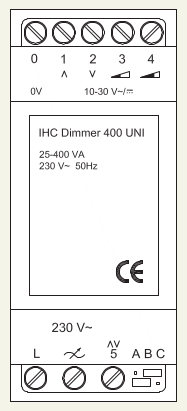

# Notes about IHC dimmers

Several dimmer models/modifications exist for the "older" IHC system.

| model   | p/n        |
|---------|------------|
| 350 CR  | 120 B 5243 |
| 350 LR  | 120 B 5242 |
| 400 UNI | 120 B 5240 |
| 600 CR  | 120 B 5245 |
| 1000 LR | 120 B 5244 |

The number and the functions of the terminals are different for every model
but the general principle is the same. You should consult the documentation
of your dimmer module for the details.

I have the 400 UNI models in my system:

It can be configured to operate with 1 or 2 buttons and it supports both
capacitive and inductive loads. The configuration is done with jumpers as
follows:

| jumper | closed           | open             |
|--------|------------------|------------------|
| `A`    | 1-button control | 2-button control |
| `B`    | capacitive load  | (see note)       |
| `C`    | inductive load   | (see note)       |

Table: 400 UNI jumpers

> [!NOTE]
> If jumpers `B` and `C` are both open, the load type will be selected automatically.

Therefore the following configurations can exist:

| ABC   | control  | load selection |
|-------|----------|----------------|
| `:::` | 2-button | automatic      |
| `❚::` | 1-button | automatic      |
| `:❚:` | 2-button | capacitive     |
| `❚❚:` | 1-button | capacitive     |
| `::❚` | 2-button | inductive      |
| `❚:❚` | 1-button | inductive      |
| `:❚❚` |          | not allowed!   |
| `❚❚❚` |          | not allowed!   |

Table: 400 UNI configurations

> [!CAUTION]
> Jumpers `B` and `C` can not be both closed!

The dimmer can be controlled with 10..30V AC/DC and/or 230VAC control voltage.
As with 230VAC control voltage we can not use all the functions, IHC Output
24 module is probably the most common choice here.

| terminal | function in 1-button mode                       | 2-button mode            |
|----------|-------------------------------------------------|--------------------------|
| `0`      | 0V from IHC                                     | --"--                    |
| `1`      | on/off (pulse), up/down (hold)                  | on (pulse), up (hold)    |
| `2`      | off                                             | off (pulse), down (hold) |
| `3`      | recall level 1 (pulse), set level 1 (hold > 2s) | --"--                    |
| `4`      | recall level 2 (pulse), set level 2 (hold > 2s) | --"--                    |
| `5`      | on/off (pulse), up/down (hold)                  | n/a                      |

Table: 400 UNI terminals

> [!NOTE]
> Pulse length must be < 0.4s!

> [!NOTE]
> Terminals 0..4 are for 24VDC from IHC, terminal 5 is for 230VAC.
