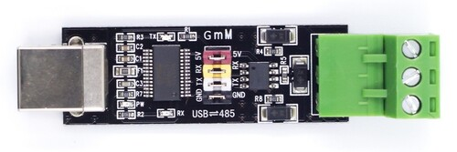

# USB to RS485 dongle

To communicate with the IHC Controller, you will need an USB to RS485 dongle.

Various dongles can be used, they usually cost a couple of dollars/euros.

I opted for [this one:](https://www.okystar.com/product-item/double-protection-usb-to-485-module-ft232-chip-usb-to-ttl-rs485-double-function-oky3406-4/)



## Connecting the RS485 dongle to the IHC Controller

Connect the wires from the RS485 dongle to the IHC Controller terminals
according to the following scheme:

- dongle `A` -> controller `+`
- dongle `B` -> controller `-`
- dongle `GND` -> controller `0V`

## Assigning a persistent USB device name

USB serial devices may get different devicenames (`ttyUSB0`...`ttyUSBn`) on
system boot or when multiple devices are getting plugged in and pulled out.
So it is usually a good idea to assign a persistent names for them.

First, find out the vendor ID and product ID of your dongle:

```bash
root@hal:~# lsusb
Bus 001 Device 004: ID 0403:6001 Future Technology Devices International, Ltd FT232 Serial (UART) IC
Bus 001 Device 003: ID 0424:ec00 Microchip Technology, Inc. (formerly SMSC) SMSC9512/9514 Fast Ethernet Adapter
Bus 001 Device 002: ID 0424:9514 Microchip Technology, Inc. (formerly SMSC) SMC9514 Hub
Bus 001 Device 001: ID 1d6b:0002 Linux Foundation 2.0 root hub
```

From the above example we find the vendor ID `0403` and product ID `6001`.

Create a file `/etc/udev/rules.d/99-usb-serial.rules` with the following content:

```
# RS485 dongle (IHC server):
SUBSYSTEM=="tty", ATTRS{idVendor}=="0403", ATTRS{idProduct}=="6001", SYMLINK+="ttyUSB.IHC"
```

Disconnect and reconnect the dongle. You should now have a new alias
`ttyUSB.IHC` created for the device:

```bash
root@hal:~# ls -l /dev/ttyUSB.IHC
lrwxrwxrwx 1 root root 7 Dec 18 15:12 /dev/ttyUSB.IHC -> ttyUSB0
```

> [!TIP]
> You can choose any name for the alias as long as it is unique.
